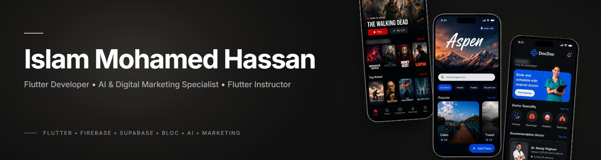
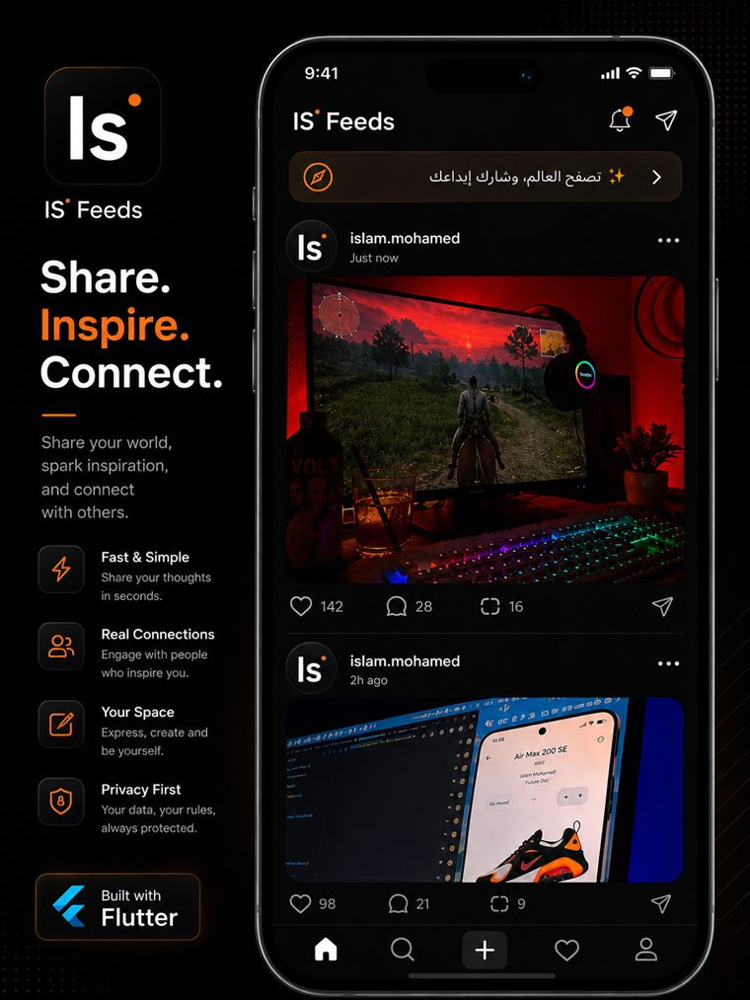

  

<h1 align="center">Islam Mohamed Hassan</h1>

  <b>Flutter Developer • AI & Digital Marketing Specialist • Flutter Instructor</b>
   
  I build mobile apps with Flutter, and I use AI-powered workflows to create marketing content and campaigns.

  
  
  

 

## 👋 About Me

I work across two fields that usually live in separate teams: **mobile development** and **AI-powered marketing**. I build Flutter apps backed by Firebase, Supabase, REST APIs and local storage, and I use AI workflows to plan and produce marketing content.

- 💼 **Now** — AI & Digital Marketing Specialist at **MGH Consultancy**: video concepts, scripts and prompts, marketing videos and visual designs for educational and professional programs.
- 🎓 **Before** — Flutter Instructor at **AMIT Learning** and Technical Mentor in **DEPI Round 3**: reviewing students' code, pointing out architectural issues and helping them debug real projects.
- 📍 **Based in** — Giza, Egypt

 

## 🧭 What I Do

| 📱 Flutter Development | 🤖 AI & Digital Marketing | 🎓 Teaching & Mentoring |
|:--|:--|:--|
| Cross-platform mobile apps in Flutter & Dart | AI-powered marketing workflows | Flutter training sessions |
| Firebase and Supabase backends | Marketing videos and promotional content | Code reviews and quality feedback |
| REST API integration with Dio | Video concepts, scripts and prompts | Architecture guidance |
| Bloc / Cubit state management | Visual designs and social media creative | Debugging support on real projects |
| Local storage, localization, animations | Content for courses and educational programs | State management, APIs, Firebase, clean architecture |

 

## 🛠️ Tech Stack

<table>
  <tr>
    <td width="170"><b>📱 Mobile</b></td>
    <td>
      
      
      
      
      
       Dio · REST APIs · Localization · Flutter Animate · Responsive UI
    </td>
  </tr>
  <tr>
    <td><b>🗄️ Backend & Data</b></td>
    <td>
      
      
      
      
       Firebase Auth · Firestore · Storage · Cloud Messaging · Shared Preferences
    </td>
  </tr>
  <tr>
    <td><b>🤖 AI & Marketing</b></td>
    <td>
      
       Prompt Engineering · AI Workflow Design · AI-Assisted Content · Social Media Content · Digital Marketing
    </td>
  </tr>
  <tr>
    <td><b>🎨 Design & Creative</b></td>
    <td>
      
       Canva · UI/UX Design · Video Creation & Editing · Graphic Design
    </td>
  </tr>
  <tr>
    <td><b>🧰 Tools</b></td>
    <td>
      
      
      
      
       VS Code · Flutter DevTools
    </td>
  </tr>
  <tr>
    <td><b>➕ Also worked with</b></td>
    <td>
      
      
      
       Google ML Kit · Maps & Geolocation · Local Notifications
    </td>
  </tr>
</table>

 

## ⭐ Featured Project

<table>
  <tr>
    <td width="42%" valign="top">
      
    </td>
    <td valign="top">
      <h3>IS' Feeds</h3>
      
<b>My main project</b> · <code>Private Project</code>

      

        A social feed app built with Flutter, focused on sharing content, discovering posts
        and connecting people through an interactive social experience.
      

      

        The app includes a post feed with likes, comments, reposts and sharing, notifications,
        post creation, search, favorites and user profiles, with support for an Arabic interface.
      

      

        
        
      

      
🔒 Proprietary project — the source code is private. Happy to walk through it on request.

    </td>
  </tr>
</table>

 

## 🚀 Public Projects

<table>
  <tr>
    <td width="50%" valign="top">
      <h3>🩺 <a href="https://github.com/esllamesso/Docdoc-App">DocDoc</a></h3>
      
Doctor appointment app connected to a REST API — sign-up and login, medical specialties, doctor listings, a multi-step booking flow (time, appointment type, payment method, summary) and a personal appointments list.

      Flutter · Cubit · Dio · REST API
    </td>
    <td width="50%" valign="top">
      <h3>✈️ <a href="https://github.com/esllamesso/firebase_app">Travella</a></h3>
      
Travel discovery app — browse places loaded from Firestore, with email/password and Google sign-in.

      Flutter · Bloc · Firebase Auth · Firestore
    </td>
  </tr>
  <tr>
    <td width="50%" valign="top">
      <h3>🎬 <a href="https://github.com/esllamesso/Movie-App">Streaming App</a></h3>
      
Streaming-style movie app showing now-playing, popular and top-rated movies from the TMDB API, with movie detail pages.

      Flutter · Cubit · Dio · TMDB API · Lottie
    </td>
    <td width="50%" valign="top">
      <h3>📚 <a href="https://github.com/esllamesso/Harry-Potter-LIB---App">Harry Potter Library</a></h3>
      
Browse the Harry Potter books and characters — book search, favorites, random and top picks, with skeleton loading.

      Flutter · Bloc · Dio
    </td>
  </tr>
</table>

 

## 🏆 Achievements & Education

- 🥉 **3rd Place** — Ministry-Level Mobile App Competition *(graduation project)*
- 💡 **Best Idea Award** — Nationwide Mobile Application Competition *(graduation project)*
- 🎓 **Bachelor of Information Systems** — Higher Institute of Advanced Studies, Giza · Graduated 2024

 

## 📫 Let's Connect

Open to Flutter development, AI-powered marketing and Flutter training work.

  <a href="https://eso-portfolio-psi.vercel.app">🌐 Portfolio</a> &nbsp;·&nbsp;
  <a href="https://www.linkedin.com/in/eslam-mohamed-9ba442297/">💼 LinkedIn</a> &nbsp;·&nbsp;
  <a href="mailto:eslammoh369@gmail.com">✉️ eslammoh369@gmail.com</a>

